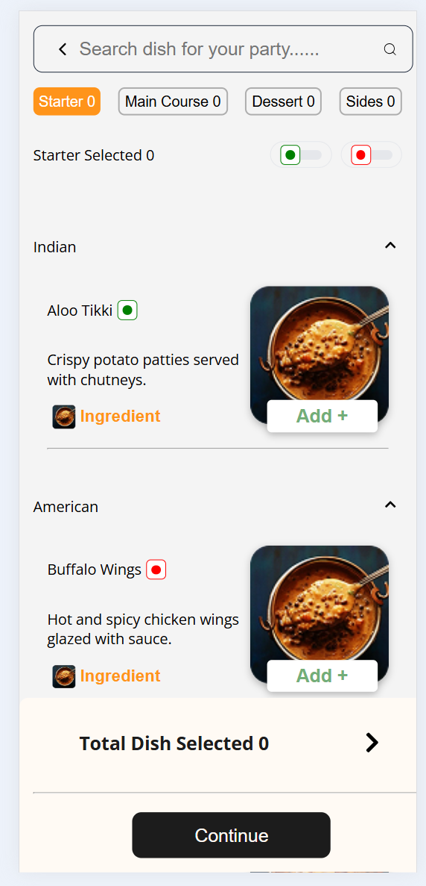
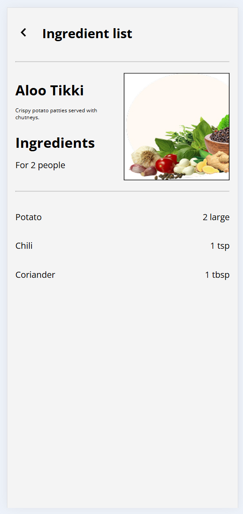

# 🍴 Tech Assignment - Party Menu Selection App

This is a web application where a user can browse a categorized menu of dishes, filter them based on different criteria, and select their desired items for a party.

## 🛠 Tools & Libraries Used

### 🖥️ Frontend


- React.js (with functional components and React Hooks)
- CSS (Responsive styling)
- React Router for navigation
- React Icons

### 💽 Database

- Used mock JSON data for dish and ingredient listings.

#### Sample Data

```json
{
    "categoryId": 1,
    "mealType": "STARTER",
    "type": "VEG",
    "description": "Crispy potato patties served with chutneys.",
    "image": "https://res.cloudinary.com/dxcwdueld/image/upload/v1757766893/image_191_kryog8.jpg",
    "category": {
      "id": 1,
      "name": "Indian",
      "image": "https://res.cloudinary.com/dxcwdueld/image/upload/v1757879774/image_207_edwnny.jpg",
      "isRecommendedForMealSuggestion": true
    },
    "dishType": "STARTER",
    "id": 101,
    "name": "Aloo Tikki",
    "ingredients": [
      { "name": "Potato", "quantity": "2 large" },
      { "name": "Chili", "quantity": "1 tsp" },
      { "name": "Coriander", "quantity": "1 tbsp" }
    ]
  }

  ```

### 📌 **Note:**  
> - Dish images are stored as **Cloudinary-hosted URLs**.  
> - For this project, a **single image** is reused across all dish types as a placeholder.


## 📂 Project Structure
```
party-menu-app/
|
├── src/
│ ├── components/
│ │ ├── DishList/ # Dish listing component (grouped, add/remove, ingredient button)
│ │ ├── Filters/ # Search bar, tabs for categories, veg/non-veg filters
│ │ ├── Home/ # Home screen (contains Filters + DishList together)
│ │ ├── Ingredients/ # Ingredient details screen
│ │
│ ├── data/ # Mock data (dishes, categories, ingredients)
│ │ └── data.js
│ │
│ ├── App.js # Main entry component, sets up routes (Home & Ingredients)
│ ├── App.css # Global styles
```
## Screenshots

### Home Page
- 🏠 Home Page (Grouped dishes with filters and search)


### Ingredients Page

- (Detailed ingredient list for each dish)


## 🚀 Features

### 1. Menu Categories
- Four meal types are displayed as selectable tabs:
  - Starter  
  - Main Course  
  - Dessert  
  - Sides  
- Selecting a tab shows only the dishes related to that category.

### 2. Dish List
- Dishes are **grouped by their category** (e.g., North Indian, Chinese, Continental).  
- Each group can be expanded or collapsed.  
- Each dish card displays:
  - Dish Name  
  - Short Description  
  - Image  
  - Button to **Add / Remove** the dish  
  - An **Ingredient** button to view detailed ingredients.  
- Added dishes are visually marked and included in the selected count.

### 3. Search Functionality
- A search bar is available at the top.  
- Filters dishes by **dish name** (case-insensitive).  
- Search applies **only within the selected meal category**.

### 4. Veg / Non-Veg Filter
- Two toggle filters: **Veg** and **Non-Veg**.  
- Filters dishes based on the selected type.  
- Filtered results update the dish list immediately.  

### 5. Dish Selection Summary
- Shows the **count of selected dishes** in each category tab.  
- Displays the **total selected dish count** at the bottom of the screen.  
- Includes a **Continue** button (further navigation is not provided after that).  

### 6. Ingredient Detail Screen
- Clicking the **Ingredient** button on a dish navigates to a new screen.  
- Displays:
  - Dish Name and Short Description  
  - Ingredient List with Quantities (mock data) 

## ⚡ Installation & Running

1. ### Clone the Repository

    ```
    git clone https://github.com/Vinay-Sathupati/party-menu-app.git
    ```
2. ### Navigate into the project

    ```
    cd party-menu-app
    ```
3. ### Install dependencies

    ```
    npm install
    ```
4. ### Start the development server

    ```
    npm start
    ```
- The app will be available at: http://localhost:3000


## ✨ Future Improvements

- Add cart and checkout flow

- Backend integration for live data

- User authentication and profile management

- Order history page


## 🎁 Contribution
Pull requests are welcome. For major changes, please open an issue first to discuss what you would like to change.
